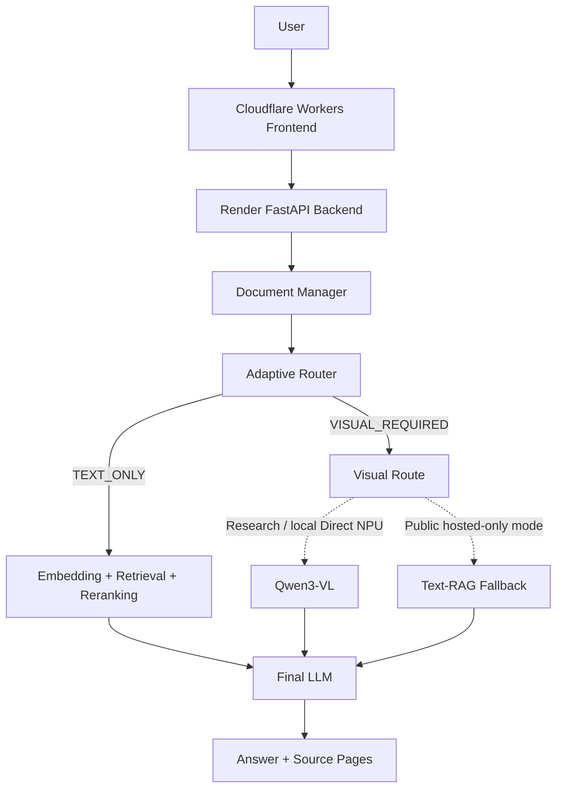

# Furiosa Agentic Paper RAG

A selective multimodal Paper RAG system that accepts a research paper PDF, retrieves evidence,
selects visual reasoning only when needed, and returns an answer with verifiable source pages.

[Live Demo](https://winter666-hub-furiosa-multimodal-rag-frontend.winter666.workers.dev) ·
[Backend](https://furiosa-multimodal-rag.onrender.com) ·
[GitHub](https://github.com/winter666-hub/furiosa-multimodal-rag)

## Project Overview

Research papers mix prose with figures, tables, and architecture diagrams. A text-only RAG
pipeline is efficient for many questions, but it can miss evidence that is primarily visual. At
the same time, sending every question to a vision model adds avoidable latency and inference cost.

This project places an adaptive router before answer generation. It classifies each question as
`TEXT_ONLY` or `VISUAL_REQUIRED`, then uses the least expensive suitable path. Text questions use
retrieval and reranking directly; visual questions can use a vision path in the research setup.

The public Cloudflare + Render demo runs in `hosted_only` mode: it reports the router decision, but
`VISUAL_REQUIRED` requests use text-RAG fallback because Direct NPU Vision is not enabled.

## Problem

Papers contain evidence in prose, tables, figures, and diagrams, but many factual questions remain
fully answerable through text retrieval. Running multimodal inference for every question therefore
wastes compute, while never using it misses visual evidence. The research question is whether
selective routing can reduce vision calls and latency while preserving routing and answer quality.

## Proposed Approach

```text
Question
  -> Adaptive Router
  -> TEXT_ONLY / VISUAL_REQUIRED
  -> Retrieval
  -> Reranking
  -> Relevant evidence
  -> Final answer generation
  -> Source page verification
```

Document preparation is isolated per uploaded PDF:

```text
PDF upload
  -> Text extraction
  -> Chunking
  -> Embedding
  -> Document-specific cache
  -> Question answering
```

## Architecture



The dashed branches distinguish two environments: Direct NPU Vision is part of the research and
local evaluation path, while the public demo deliberately uses hosted text fallback.

RAG has four roles here: **retrieval** finds relevant PDF chunks, **augmentation** gives those
chunks to the final LLM, **generation** produces an evidence-bound answer, and **verification**
returns user-facing one-based source pages with the retrieved passage kept as internal metadata.

## Furiosa Integration

The hosted text pipeline uses Furiosa-compatible model endpoints:

- `furiosa-ai/Qwen3-Embedding-8B` for document and query embeddings
- `furiosa-ai/Qwen3-Reranker-8B` for passage reranking
- `furiosa-ai/Qwen3-32B-FP8` for routing fallback and final answer generation

The research/local visual path uses `furiosa-ai/Qwen3-VL-32B-Instruct` through a Direct NPU
endpoint. “Hosted API” and “Direct NPU” are separate deployment paths; the public demo does not
claim to run Direct NPU Vision.

## Key Features

- Arbitrary PDF upload, SHA-256 IDs, path-safe isolation, and duplicate cache reuse
- Retrieval, reranking, adaptive routing, and evidence-grounded generation
- Source-page buttons, referenced passages, responsive text highlights, and PDF replacement
- Process-local rate/concurrency limits and bounded TTL/storage cleanup
- Trusted Cloudflare-to-Render client-IP forwarding with a shared proxy secret

## Research Results

The checked-in 15-question E2E evaluation compares always-on vision with adaptive routing. The
dataset contains five text, five explicit-visual, and five implicit-visual questions.

| Metric | Always Vision | Adaptive | Change |
|---|---:|---:|---:|
| Vision calls | 15 | 9 | -40.0% |
| Average E2E latency | 13.053 s | 10.479 s | -19.7% |
| Text-query latency | 14.076 s | 6.560 s | -53.4% |

Full methodology and checked-in result tables: [Benchmark Report](benchmarks/README.md).

On the same E2E set, adaptive routing produced:

| Routing metric | Result |
|---|---:|
| Correct routes | 14 / 15 |
| Accuracy | 93.3% |
| Visual recall | 90.0% |
| Visual precision | 100.0% |

The only false negative was the implicit-visual question `E_A02`. Its answer-quality scores were
10 for Always Vision and 7 for both pure LLM routing and Adaptive routing. This connects a routing
miss to a measurable downstream quality loss and identifies implicit visual intent as the main
remaining research problem.

The answer-quality artifact is preliminary rather than a completed 15/15 evaluation: the CSV has
45 strategy-question rows, with 44 successful judge results and one recorded judge parsing error.
See the [Benchmark Report](benchmarks/README.md) for the preliminary strategy aggregates.

## Router-Only Benchmark

The separate 60-question holdout measures routing overhead independently from retrieval and answer
generation:

| Router | Average routing latency |
|---|---:|
| Pure LLM | 281.34 ms |
| Adaptive | 135.97 ms |
| Reduction | 51.67% |

The [Benchmark Report](benchmarks/README.md) records the full holdout table. These router-only
numbers are intentionally kept separate from the E2E latency table.

## Public Demo Usage

1. Open the [live demo](https://winter666-hub-furiosa-multimodal-rag-frontend.winter666.workers.dev).
2. Upload a PDF and wait for the document-ready state.
3. Ask a question about the paper.
4. Review the answer, route, and fallback indicators.
5. Click a source `Page` button.
6. Compare the answer with the rendered original page.

## Source Verification

Answers do not expose internal chunk identifiers or application citation markers. The `Sources`
controls show only page labels; opening one displays the cited PDF page and the actual retrieved
passage used for grounding. When PyMuPDF can locate a stable text anchor, the matching PDF-space
rectangle is overlaid responsively on the rendered page. Source pages are rendered at higher
resolution for easier inspection.

Text-coordinate lookup is best-effort. Scanned or image-only pages, complex multi-column layouts,
hyphenated text, formulas, and figure-only evidence may not produce a highlight. The page preview
and referenced excerpt remain available as the fallback, without OCR or a user-facing error.

Example questions:

- “Summarize the paper's three main contributions.”
- “Explain the paper's main methodology.”
- “What do the experimental setup and key results show?”
- “What are the limitations of this paper?”

## Tech Stack

| Area | Technologies |
|---|---|
| Frontend | TanStack Start, React, TypeScript, Cloudflare Workers |
| Backend | FastAPI, Python, PyMuPDF, NumPy |
| AI | Furiosa Hosted API, Qwen3 Embedding, Reranker, LLM, Qwen3-VL research route |
| Evaluation | pytest, custom routing benchmark, E2E benchmark, answer-quality judge |

## Repository Structure

```text
furiosa-multimodal-rag/
├── frontend/                  # TanStack Start UI and Cloudflare server routes
├── src/furiosa_rag/
│   ├── web/                   # FastAPI app, document store, abuse controls
│   ├── clients/               # Furiosa-compatible HTTP client
│   ├── cli/                   # Diagnostics and benchmark commands
│   ├── pipeline.py            # Text and multimodal RAG orchestration
│   ├── router.py              # Rule, LLM, and adaptive routers
│   └── retrieval.py           # Vector retrieval
├── tests/                     # Deterministic unit and web tests
├── benchmarks/                # Evaluation sets and checked-in result CSVs
├── DEPLOY_RENDER.md           # Backend deployment and hardening details
├── pyproject.toml
└── README.md
```

## Local Development

```bash
python -m venv .venv
# Windows: .venv\Scripts\activate
python -m pip install -r requirements.txt
python -m pytest
```

Copy `.env.example` to `.env` and provide only the endpoints you intend to use. Diagnostic commands
are available as `python -m furiosa_rag.cli.check_connection` and
`python -m furiosa_rag.cli.smoke_test`.

```bash
cd frontend
bun install
bun run dev
```

## Deployment

- **Frontend:** Cloudflare Workers
- **Backend:** Render
- **Hosted inference:** Furiosa Hosted API

The frontend and backend must share a server-side `PAPER_RAG_PROXY_SECRET`; it is distinct from
`FURIOSA_API_KEY` and must not enter the browser bundle. See [DEPLOY_RENDER.md](DEPLOY_RENDER.md)
for environment variables, start commands, health checks, upload behavior, and proxy details.

The Render backend can optionally persist successful conversations to PostgreSQL when
`DATABASE_URL` is configured. The browser creates a tab-scoped anonymous session UUID, and the UI
discloses near the question input that questions and AI responses may be stored for service
improvement and research analysis. Persistence is disabled when `DATABASE_URL` is absent and is
best-effort when the database is unavailable. See [DEPLOY_RENDER.md](DEPLOY_RENDER.md) for the
stored-field boundary and setup details.

The public demo includes process-local IP rate limits, upload/ask concurrency caps, a 25 MB PDF
limit, `MAX_DOCUMENTS`, `DOCUMENT_TTL_HOURS`, and `MAX_DOCUMENT_STORAGE_MB`. Cloudflare forwards
its verified client address to Render only with the shared proxy token; untrusted forwarded-IP
headers are ignored.

These controls are appropriate for the current single-instance demo. They are not a distributed,
production-grade security layer.

## Limitations

- The public demo is hosted-only; Direct NPU Vision is not active.
- `VISUAL_REQUIRED` requests use text-RAG fallback in the public deployment.
- Render storage is ephemeral, so uploaded PDFs can disappear after restart or redeployment.
- Rate limits, concurrency state, and active-document tracking are process-local.
- The UI maintains one active document session at a time.
- The current benchmark is small and based on one paper-oriented evaluation set.
- Implicit visual questions remain the hardest routing cases.
- Conversation-log retention and deletion are not automated yet; a formal retention policy is
  required before long-term research use.

## Future Work

- A defined conversation-log retention/deletion policy and operator access controls
- Durable document storage and distributed rate limiting
- A public Direct-NPU visual path and better implicit-visual routing
- Larger multi-domain benchmarks, multi-document RAG, and asynchronous indexing

## Security

`.env`, SSH/private keys, uploaded PDFs, runtime caches, benchmark outputs, and frontend builds are
ignored. Keep Furiosa keys and proxy secrets in deployment stores; never commit user documents.

## Tests

Verified status: **132 backend tests passed**, **Ruff passed**, and the **frontend production build
succeeded**.

The repository has historical frontend-wide CRLF/Prettier lint noise, so this README does not claim
a clean full-project frontend lint run.
